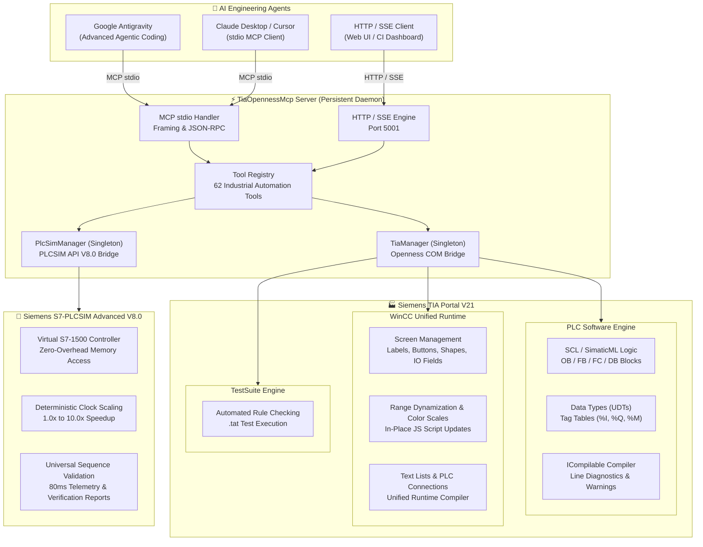
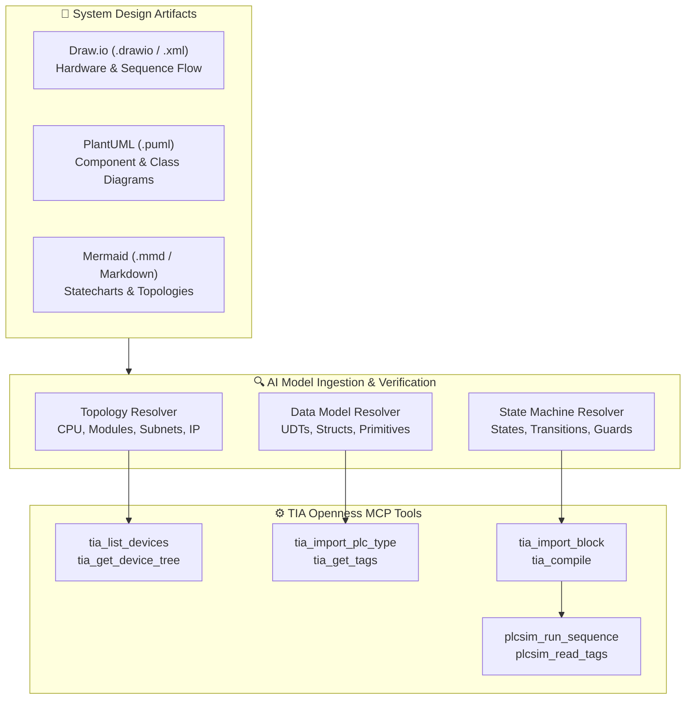
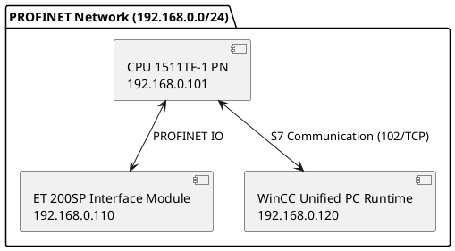
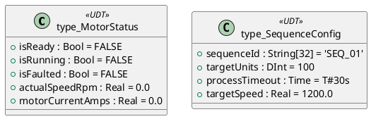
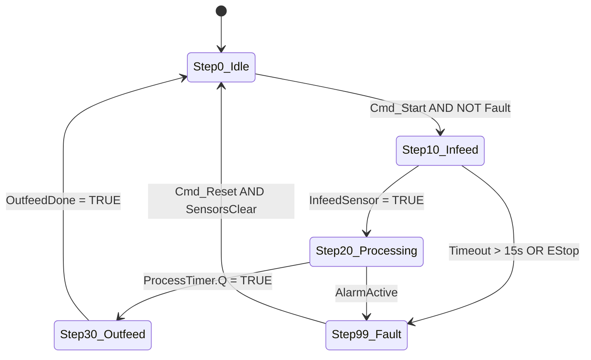
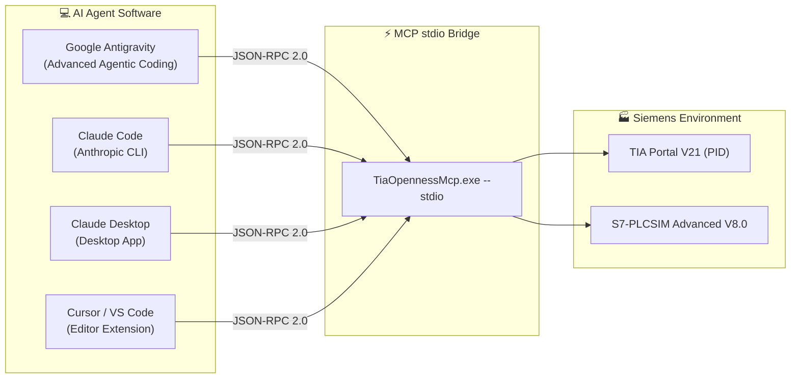

# TIA-MCP-Server: Siemens TIA Portal V21 & S7-PLCSIM Advanced Openness MCP Server

[](https://support.industry.siemens.com)
[](https://support.industry.siemens.com)
[](https://modelcontextprotocol.io)
[](https://dotnet.microsoft.com)
[](#complete-tools-reference-dictionary-62-tools)
[](LICENSE)

A high-performance, persistent **Model Context Protocol (MCP)** server providing AI coding agents (such as **Google Antigravity**, **Claude Desktop**, **Cursor**, and **VS Code**) with direct programmatic control over **Siemens TIA Portal V21** and **S7-PLCSIM Advanced V8.0**.

Equipped with **62 specialized industrial automation tools**, this server bridges generative AI with deterministic industrial hardware and software—enabling automated PLC logic authoring, model-based architecture ingestion (Draw.io / PlantUML / Mermaid), automated design-to-HMI pipelines (Figma to WinCC Unified), live simulation memory I/O, and automated Hardware-in-the-Loop (HIL) sequence verification with telemetry report generation.

---

## Architecture & Technology Stack

```
 +---------------------------------------------------------------------------------------+
 |                     AI Agents / Pair Programmers (Antigravity, Claude, Cursor)        |
 +---------------------------+-------------------------------+---------------------------+
                             |                               |
               HTTP JSON-RPC | Server-Sent Events (SSE)      | Standard I/O (MCP stdio)
               POST /mcp     | GET /sse                      | stdin / stdout
                             v                               v
 +---------------------------------------------------------------------------------------+
 |                    TiaOpennessMcp Persistent Daemon (Port 5001)                       |
 |                                                                                       |
 |  [ServerConfig]                 [HttpMcpServer]              [McpServer]              |
 |  - config.json (Host/Port)      - Multi-client SSE Sessions  - stdio framing          |
 |  - AutoConnect & PID binding    - POST /mcp & /status        - stderr logging         |
 |                                                                                       |
 |  [TiaManager Singleton]                     [PlcSimManager Singleton]                 |
 |  - Persistent COM connection                - S7-PLCSIM Advanced API V8.0             |
 |  - TiaPortal & Project handles              - Shared Memory Controller Link           |
 |  - Dynamic Openness Assembly Resolver       - High-Speed Symbolic Tag Cache           |
 |  - 50 Openness Tools (PLC, HMI, TestSuite)  - 12 Virtual Simulation & Testing Tools   |
 +------------------------------+-------------------------------+------------------------+
                                |                               |
       Siemens TIA Openness COM | PublicAPI                     | Simulation Runtime API
                                v                               v
 +----------------------------------------------+ +--------------------------------------+
 |           Siemens TIA Portal V21             | |   Siemens S7-PLCSIM Advanced V8.0    |
 | - Hardware Configuration & Device Tree       | | - Virtual S7-1500 Controller (Run)   |
 | - PLC Logic (OB, FB, FC, DB, SCL, SimaticML) | | - Zero-Overhead Memory Read/Write    |
 | - WinCC Unified PC Runtime (Screens, Items)  | | - Deterministic Clock Scaling        |
 | - Siemens TestSuite Automated Rule Execution | | - Automated Online Sequence Runner   |
 +----------------------------------------------+ +--------------------------------------+
```

### Architectural Tenets:
1. **Always-On Connection Persistence (`connexion must stay`)**: TIA Portal and project instances are heavy COM entities requiring significant startup time. `TiaManager` and `PlcSimManager` maintain live handles in memory so every AI turn executes with sub-second latency without reloading the project.
2. **Dual-Transport Flexibility**: Standard MCP stdio for agent runners, alongside a concurrent HTTP/SSE daemon (port `5001`) for web interfaces, live telemetry dashboards, and multi-agent orchestrators.
3. **Clean-Room Assembly Loading**: Dynamically resolves Siemens assemblies from local installation paths (`PublicAPI\V21\net48\` and `PLCSIMADV\API\8.0\`), avoiding unauthorized binary redistribution while ensuring 100% binary compatibility with Siemens updates.

---

## Core Capabilities



### 1. TIA Portal Core & PLC Engineering (19 Tools)
- **Lifecycle & Instances**: Discover running PIDs (`tia_list_processes`), attach silently (`tia_connect`), open projects headless or with GUI (`tia_open_project`), save (`tia_save_project`), and close (`tia_close_project`).
- **Hardware Topology**: Inspect racks, subnets, slots, CPU modules, and distributed I/O stations (`tia_list_devices`, `tia_get_device_tree`).
- **Software Logic & Blocks**: Enumerate blocks with language and consistency state (`tia_list_blocks`), export block code as SimaticML XML with extracted SCL (`tia_get_block_code`), import/overwrite logic (`tia_import_block`), and delete obsolete blocks (`tia_delete_block`).
- **Data Types & Tags**: Author User Data Types (`tia_list_plc_types`, `tia_import_plc_type`) and manage tag tables (`tia_list_tag_tables`, `tia_get_tags`).
- **Native Diagnostics**: Compile software containers via `ICompilable` and return exact error messages, line numbers, and warnings (`tia_compile`).

### 2. WinCC Unified HMI Engineering (29 Tools)
- **Screen Management**: Create, delete, and list Unified screens (`hmi_list_screens`, `hmi_create_screen`, `hmi_delete_screen`).
- **Widgets & UI Elements**: Programmatically position labels with HTML typography (`hmi_add_label`), pushbuttons (`hmi_add_button`), geometric shapes (`hmi_add_shape`), and process I/O fields (`hmi_add_io_field`).
- **Range Dynamization**: Dynamize properties (e.g. `BackColor`, font color) to integer/real tags using `ConditionType.Range` (`hmi_set_tag_dynamization`).
- **In-Place Script Updates**: Safely update button JavaScript handlers in-place without deleting or disrupting layout coordinates (`hmi_update_button_scripts`).
- **Communication & Text Lists**: Create device-level text lists (`hmi_create_text_list`), export text lists (`hmi_export_text_lists`), and establish HMI-to-PLC communication links (`hmi_create_connection`).
- **Compile Diagnostics**: Full Unified runtime compilation diagnostics with item-level error reporting (`hmi_compile`).

### 3. S7-PLCSIM Advanced Live Simulation & Testing (12 Tools)
- **Direct Runtime Link**: Connects to virtual S7-1500 controllers via shared memory API V8.0 (`plcsim_connect`).
- **Operating Modes**: Query status (`plcsim_get_status`) and switch CPU operating modes (`plcsim_set_operating_state`: `Run`, `Stop`, `MemoryReset`).
- **Clock Scaling**: Accelerate simulation deterministically (`plcsim_set_scale_factor`: e.g. `2.0x` or `5.0x` speed).
- **Zero-Overhead Memory I/O**: High-speed symbolic tag reading and writing (`plcsim_read_tag`, `plcsim_write_tag`, `plcsim_read_tags`, `plcsim_write_tags`).
- **Universal Sequence Validation**: Execute parameterized sequence tests on any state machine (`plcsim_run_sequence`), sample 80ms telemetry, verify state transitions, and generate validation reports.

### 4. Siemens TestSuite Automation (2 Tools)
- Enumerate configured project test cases (`tia_testsuite_list_tests`).
- Import and reload `.tat` rule files with `ImportOptions.Override` (`tia_testsuite_load_test`).

---

## Figma to WinCC Unified Workflow

The MCP server enables an automated **Design-to-Industrial HMI** pipeline, transforming UI/UX designs into production-ready WinCC Unified V21 screens.

```mermaid
flowchart LR
    Figma["🎨 Figma Design<br/>(Frames, Tokens, SVGs)"] -->|Export JSON & Vectors| Ingestion["🤖 AI Agent Ingestion<br/>(Geometry & Token Mapping)"]
    Ingestion -->|hmi_create_screen & hmi_add_*| Creation["🖥️ WinCC Unified Screens<br/>(Widgets, Shapes, IO Fields)"]
    Creation -->|hmi_set_tag_dynamization| Dynamization["⚡ Range Dynamization<br/>(Multi-state Color Feedback)"]
    Dynamization -->|hmi_update_button_scripts| Scripting["📜 In-Place Scripting<br/>(Safe JavaScript Handlers)"]
    Scripting -->|hmi_compile| Compilation["✅ Unified Compiler<br/>(Zero Error Verification)"]
```



### Pipeline Stages:
1. **Design & Token Export (Figma)**:
   - Designers organize screens in Figma frames with layout grids (e.g. 1920x1080 or custom industrial aspect ratios).
   - Component tokens are exported (geometry: `x`, `y`, `width`, `height`; styles: background fill, borders, typography; vector graphics as SVGs).
2. **AI Agent Ingestion & Translation**:
   - The AI agent parses design coordinates and converts CSS/hex colors into WinCC Unified ARGB format (`#AARRGGBB` or `#RRGGBB`).
   - Figma visual elements map directly to native WinCC Unified primitives:
     - Text frames $\rightarrow$ `hmi_add_label` (with embedded HTML formatting).
     - Rectangles / Cards / Containers $\rightarrow$ `hmi_add_shape` (`Rectangle`).
     - Action elements $\rightarrow$ `hmi_add_button`.
     - Data displays & entry $\rightarrow$ `hmi_add_io_field` (bound to PLC tags).
3. **Screen Creation & Placement**:
   - Creates targeted screen: `hmi_create_screen` (e.g. `MainOperation`, `Diagnostics`).
   - Populates screen widgets with exact pixel coordinates.
4. **Range Dynamization & Color States**:
   - Binds visual attributes (such as background color) to PLC status tags using `hmi_set_tag_dynamization`.
   - Supports multi-level range mapping (e.g. `0..0: Stopped (#6C757D)`, `10..50: Running (#28A745)`, `99..99: Fault (#DC3545)`).
5. **In-Place Script Updates**:
   - Injects JavaScript event handlers via `hmi_update_button_scripts`.
   - Modifies existing buttons in-place without widget re-creation, preserving all coordinate bindings and visual stacking order.
6. **Unified Runtime Verification**:
   - Validates the resulting screen via `hmi_compile`, returning compilation diagnostics directly to the agent.

---

## Model-Based Engineering: UML & Architecture Ingestion

The MCP server accepts structured system models to synthesize hardware configuration, PLC User Data Types (UDTs), and state machine logic directly from engineering diagrams.



### 1. Hardware Topology Ingestion (Component / Deployment Diagrams)
The server expects architecture diagrams detailing:
- **Controller Module**: Family, CPU catalog number (e.g. `CPU 1511TF-1 PN`, `6ES7 511-1TK01-0AB0`), firmware version.
- **Network Interfaces**: PROFINET / Industrial Ethernet subnets, station names, IP addresses, and subnet masks.
- **Distributed I/O**: Rack/slot assignments, I/O module order numbers (e.g. digital inputs, analog outputs, motion modules).

#### Expected Ingestion Format (Example: PlantUML Component Diagram):


### 2. Data Types & UDTs Ingestion (Class / Structure Diagrams)
For software data models, the server expects structured types specifying field names, primitive or composite data types, default initial values, and engineering comments.

#### Expected Ingestion Format (Example: Draw.io / PlantUML Class Diagram):

*The agent translates these structures directly into SimaticML XML definitions and invokes `tia_import_plc_type`.*

### 3. State Machines & Sequences Ingestion (Statechart Diagrams)
To generate deterministic sequence blocks, provide a statechart defining:
- **States & Step Numbers**: Explicit integer indexing (e.g. `0: IDLE`, `10: INFEED`, `20: PROCESSING`, `30: OUTFEED`, `99: FAULT`).
- **Guards & Conditions**: Explicit boolean conditions or sensor thresholds required to transition.
- **Actions**: Outputs activated in each state.
- **Timeouts & Abort Paths**: Maximum duration per state before triggering alarm/recovery.

#### Expected Ingestion Format (Example: Mermaid Statechart):

*The agent generates structured IEC 61131-3 SCL `CASE currentStep OF ... END_CASE;` logic, imports it via `tia_import_block`, compiles via `tia_compile`, and validates execution live in S7-PLCSIM Advanced via `plcsim_run_sequence`.*

---

## Complete Tools Reference Dictionary (62 Tools)

| # | Tool Name | Category | Primary Parameters | Description |
|:---:|:---|:---:|:---|:---|
| 1 | `tia_get_status` | Connection | *(none)* | Live connection status, attached PID, and open project metadata. |
| 2 | `tia_list_processes` | Connection | *(none)* | Enumerate all running TIA Portal instances. |
| 3 | `tia_connect` | Connection | `process_id` (opt) | Attach to a running TIA Portal instance. |
| 4 | `tia_disconnect` | Connection | *(none)* | Detach from active TIA Portal instance. |
| 5 | `tia_get_project_info` | Connection | *(none)* | Project metadata (author, path, modified timestamp). |
| 6 | `tia_open_project` | Connection | `project_path`, `with_gui` | Open a `.ap21` or `.ap20` project file. |
| 7 | `tia_save_project` | Connection | *(none)* | Save modifications to open project. |
| 8 | `tia_close_project` | Connection | *(none)* | Close current project. |
| 9 | `tia_list_devices` | Hardware | *(none)* | List all physical and logical devices. |
| 10 | `tia_get_device_tree` | Hardware | `device_name` | Inspect device slots, modules, and subnets. |
| 11 | `tia_list_plcs` | PLC Logic | *(none)* | Summary of all PLCs and software counts. |
| 12 | `tia_list_blocks` | PLC Logic | `plc_name`, `block_type`, `folder` | Enumerate OB, FB, FC, and DB blocks with language & status. |
| 13 | `tia_get_block_code` | PLC Logic | `block_name`, `plc_name` | Export block as SimaticML XML & extract SCL. |
| 14 | `tia_import_block` | PLC Logic | `xml_content`, `plc_name`, `overwrite` | Import or update block logic via SimaticML XML. |
| 15 | `tia_delete_block` | PLC Logic | `block_name`, `plc_name` | Delete a PLC program block. |
| 16 | `tia_list_plc_types` | Data Types | `plc_name` | List all User Data Types (UDTs). |
| 17 | `tia_get_plc_type` | Data Types | `type_name`, `plc_name` | Export UDT definition as SimaticML XML. |
| 18 | `tia_import_plc_type` | Data Types | `xml_content`, `plc_name`, `overwrite` | Import or update a UDT definition. |
| 19 | `tia_compile` | Compilation | `plc_name` | Compile PLC software & return error diagnostic log. |
| 20 | `hmi_list_targets` | HMI Runtime | *(none)* | List all HMI software instances (e.g. `PC-System_1/HMI_RT_1`). |
| 21 | `hmi_list_screens` | HMI Screen | `target_name` (opt) | List all screens with resolution and item counts. |
| 22 | `hmi_create_screen` | HMI Screen | `screen_name`, `width`, `height` | Create a new WinCC Unified screen. |
| 23 | `hmi_delete_screen` | HMI Screen | `screen_name` | Delete a screen from HMI software. |
| 24 | `hmi_get_screen_items` | HMI Screen | `screen_name` | Retrieve all screen widgets, coordinates, and scripts. |
| 25 | `hmi_delete_screen_items` | HMI Screen | `screen_name`, `item_names`, `prefix` | Delete specific screen widgets. |
| 26 | `hmi_add_label` | HMI Widget | `screen_name`, `name`, `text`, `left`, `top` | Add HTML-formatted text label with typography controls. |
| 27 | `hmi_add_button` | HMI Widget | `screen_name`, `name`, `text`, `script` | Add pushbutton with OnClick JavaScript script. |
| 28 | `hmi_add_shape` | HMI Widget | `screen_name`, `type`, `width`, `height` | Add rectangle or circle with border and fill styling. |
| 29 | `hmi_add_io_field` | HMI Widget | `screen_name`, `name`, `process_value_tag` | Add numeric/string Input-Output field bound to tag. |
| 30 | `hmi_set_tag_dynamization`| HMI Logic | `screen_name`, `item_name`, `ranges` | Bind property (e.g. `BackColor`) to tag using Range entries. |
| 31 | `hmi_update_button_scripts`| HMI Logic | `screen_name`, `button_name`, `script` | Update existing button scripts **in-place** with JS validation. |
| 32 | `hmi_list_tag_tables` | HMI Tags | `target_name` (opt) | List HMI tag tables. |
| 33 | `hmi_list_tags` | HMI Tags | `table_name` | List HMI tags with data types and connection bindings. |
| 34 | `hmi_create_tag` | HMI Tags | `table_name`, `tag_name`, `connection` | Create HMI tag mapped to PLC address. |
| 35 | `hmi_update_tag_acquisition_cycles` | HMI Tags | `tags` | Configure acquisition cycle rate (e.g. 100ms, 1s). |
| 36 | `hmi_set_tag_range` | HMI Tags | `table_name`, `tag_name`, `min`, `max` | Configure linear limits and scaling. |
| 37 | `hmi_create_data_log` | HMI Logging | `log_name`, `max_size_mb` | Create historical circular data log. |
| 38 | `hmi_assign_logging_tags` | HMI Logging | `log_name`, `tag_names` | Assign process tags to historical archive. |
| 39 | `hmi_list_connections` | HMI Comm | `device_name` (opt) | Enumerate all configured HMI communication links. |
| 40 | `hmi_create_connection` | HMI Comm | `connection_name`, `plc_device_name` | Create a communication link between HMI and PLC. |
| 41 | `hmi_delete_connection` | HMI Comm | `connection_name` | Remove an HMI communication link. |
| 42 | `hmi_list_text_lists` | HMI Text | `device_name` (opt) | Enumerate all text and graphic lists. |
| 43 | `hmi_create_text_list` | HMI Text | `name`, `list_type`, `entries` | Create value or range text list (e.g. status decoders). |
| 44 | `hmi_delete_text_list` | HMI Text | `name` | Remove a text list. |
| 45 | `hmi_export_text_lists` | HMI Text | `destination_folder`, `base_filename`| Export text lists to `.hmi.yml` files. |
| 46 | `hmi_compile` | Compilation | `target_name` | Compile WinCC Unified runtime with diagnostics. |
| 47 | `tia_list_tag_tables` | PLC Tags | `plc_name` | List PLC tag tables. |
| 48 | `tia_get_tags` | PLC Tags | `table_name`, `plc_name` | Read PLC tags with `%I`, `%Q`, `%M` addresses. |
| 49 | `tia_testsuite_list_tests`| TestSuite | `plc_name` | List configured Siemens TestSuite test cases. |
| 50 | `tia_testsuite_load_test` | TestSuite | `file_path` | Import or reload `.tat` rule file with override. |
| 51 | `plcsim_list_instances` | Simulation | *(none)* | List all registered S7-PLCSIM Advanced instances. |
| 52 | `plcsim_connect` | Simulation | `instance_name` (default `"PLC_1"`) | Connect to S7-PLCSIM Advanced and cache symbolic tags. |
| 53 | `plcsim_disconnect` | Simulation | *(none)* | Detach from active PLCSIM instance. |
| 54 | `plcsim_get_status` | Simulation | *(none)* | Real-time status (Run/Stop, scale factor, tag counts). |
| 55 | `plcsim_set_operating_state` | Simulation | `state` (`"Run"`, `"Stop"`, `"MemoryReset"`) | Switch virtual controller operating state. |
| 56 | `plcsim_set_scale_factor` | Simulation | `scale_factor` (e.g. `2.0`) | Scale simulation clock to speed up execution. |
| 57 | `plcsim_read_tag` | Live I/O | `tag_name` | Read live DB, I, Q, or M variable by symbolic name. |
| 58 | `plcsim_write_tag` | Live I/O | `tag_name`, `value` | Write live value to variable in virtual PLC memory. |
| 59 | `plcsim_read_tags` | Live I/O | `tag_names` | Bulk read multiple variables in a single call. |
| 60 | `plcsim_write_tags` | Live I/O | `tags` (key-value object) | Bulk write multiple variables in a single call. |
| 61 | `plcsim_run_sequence` | Verification | `start_command_tag`, `step_number_tag`, `done_tag`, ... | Universal automated sequence testing for any state machine. |
| 62 | `plcsim_run_mixing_sequence`| Verification | Recipe parameters, `scale_factor` | Automated multi-parameter batch testing runner. |

---

## Universal Sequence Testing & Verification Workflow

The MCP server provides automated online sequence validation against S7-PLCSIM Advanced controllers. The tool `plcsim_run_sequence` applies to **any industrial sequence** (assembly lines, batch processing, packaging machinery, pick-and-place, stamping, motion indexing).

### Tool Invocation Example:
```json
{
  "sequence_name": "AssemblyCycle_Stage1",
  "start_command_tag": "DB_Sequence.cmdStart",
  "reset_command_tag": "DB_Sequence.cmdReset",
  "step_number_tag": "DB_Sequence.currentStep",
  "step_name_tag": "DB_Sequence.currentStepName",
  "done_tag": "DB_Sequence.isDone",
  "fault_tag": "DB_Sequence.isFault",
  "idle_step": 0,
  "parameter_tags": {
    "DB_Sequence.config.targetSpeed": 1200.0,
    "DB_Sequence.config.targetCount": 50
  },
  "monitored_tags": [
    "DB_Sequence.actualSpeed",
    "DB_Sequence.currentCount",
    "DB_Sequence.motorCurrent"
  ],
  "scale_factor": 2.0,
  "timeout_seconds": 60
}
```

### Sample Automated Verification Report:
```markdown
# S7-PLCSIM Advanced Sequence Verification Report

> **Target Controller**: `PLC_1` (CPU: `CPU1511TF`, IP: `192.168.0.101`)  
> **Sequence Tested**: `AssemblyCycle_Stage1` | **Status**: ✅ **PASS**

| Phase / Step # | Step Name | Duration (s) | Monitored Tag Mean | Peak Value | Result |
|:---:|:---|:---:|:---:|:---:|:---:|
| Step 0 | `IDLE` | 0.20 s | 0.0 RPM | 0.0 A | ✅ PASS |
| Step 10 | `PREPARATION` | 1.85 s | 250.4 RPM | 4.2 A | ✅ PASS |
| Step 20 | `ACTIVE_PROCESSING`| 5.40 s | 1200.1 RPM | 11.8 A | ✅ PASS |
| Step 30 | `TRANSFER_COMPLETION`| 2.10 s | 120.0 RPM | 3.1 A | ✅ PASS |
| Step 0 | `IDLE` | -- | 0.0 RPM | 0.0 A | ✅ PASS |
```

---

## Getting Started

### 1. Prerequisites
- **Operating System**: Windows 10/11 x64 or Windows Server 2022.
- **Siemens TIA Portal**: V21 installed with Openness option enabled.
- **S7-PLCSIM Advanced**: V8.0 (required for live virtual controller I/O and sequence testing).
- **Runtime**: .NET Framework 4.8 (pre-installed on Windows 10/11).

### 2. Standalone Release (No Build Required)
A pre-compiled, self-contained release package is available directly in the [`release/`](release/) folder:
- **`release/TiaOpennessMcp.exe`**: Pre-built executable (.NET Framework 4.8 x64).
- **`release/config.json`**: Server configuration file.
- **`release/register-whitelist.ps1`**: PowerShell script to authorize Openness access.
- **Dependency DLLs**: All required runtime libraries bundled.

### 3. Building from Source (Optional)
If you wish to modify or build the server yourself:
```powershell
git clone https://github.com/dodup/TIA-MCP-Server.git
cd TIA-MCP-Server\src
dotnet build -c Release
```
Output binary: `src\bin\Release\net48\TiaOpennessMcp.exe`.

### 4. Siemens Openness Whitelist Authorization (One-Time Setup)
Siemens TIA Portal requires external applications accessing its Openness API to be registered in the Windows Registry with their file path and SHA-256 hash.

#### Option A: Automated PowerShell Whitelist (Run as Administrator)
```powershell
powershell -ExecutionPolicy Bypass -File .\release\register-whitelist.ps1
```

#### Option B: Direct CLI Registration (Run as Administrator)
```powershell
.\release\TiaOpennessMcp.exe --register-whitelist
```

#### Option C: Interactive Confirmation
On first connection, TIA Portal presents an interactive security dialog:
> *"A client application wants to access the TIA Portal. Allow access?"*  
Select **"Always allow this application"**.

---

## Connecting with AI Agents

The MCP server connects seamlessly with leading AI pair programming agents including **Google Antigravity**, **Claude Code**, **Claude Desktop**, and **Cursor**.



### 1. Google Antigravity Setup

Google Antigravity natively loads MCP servers and supports rich agent skills.

#### A. Configure MCP Server in `mcp_config.json`
Open or create your Antigravity MCP configuration file at:
`C:\Users\<username>\.gemini\config\mcp_config.json` (or `~/.gemini/config/mcp_config.json`):

```json
{
  "mcpServers": {
    "tia-portal-v21": {
      "command": "C:\\path\\to\\TIA-MCP-Server\\release\\TiaOpennessMcp.exe",
      "args": ["--stdio"]
    }
  }
}
```
*(Replace `C:\\path\\to\\TIA-MCP-Server\\release` with your actual absolute path using escaped backslashes `\\`)*.

#### B. Tool Schema Registration (Lazy Loading)
To enable Antigravity to lazy-load all 62 tools on demand, copy the JSON schemas from the repository's `schemas/` folder into your Antigravity MCP directory:
```powershell
New-Item -ItemType Directory -Path "$env:USERPROFILE\.gemini\antigravity\mcp\tia-portal-v21" -Force
Copy-Item -Path ".\schemas\*.json" -Destination "$env:USERPROFILE\.gemini\antigravity\mcp\tia-portal-v21\" -Force
```

#### C. Install Packaged Agent Skills
Copy the specialized skills from `.agents/skills/` into your active project workspace:
```powershell
Copy-Item -Path ".\.agents\skills\*" -Destination "C:\path\to\your\workspace\.agents\skills\" -Recurse -Force
```

#### D. Verify Connection
In your Antigravity chat, simply type:
> *"Check TIA Portal connection status and list open projects."*  
Antigravity will invoke `tia_get_status` and display the active TIA Portal instance, process ID, and loaded project.

---

### 2. Claude Code Setup (Anthropic CLI)

Claude Code supports adding MCP servers directly from the terminal or via project settings.

#### Option A: One-Command CLI Registration
In your terminal, run:
```powershell
claude mcp add tia-portal-v21 -- C:\path\to\TIA-MCP-Server\release\TiaOpennessMcp.exe --stdio
```

#### Option B: Project Configuration (`.claude.json`)
Create or edit `.claude.json` in your project root:
```json
{
  "mcpServers": {
    "tia-portal-v21": {
      "command": "C:\\path\\to\\TIA-MCP-Server\\release\\TiaOpennessMcp.exe",
      "args": ["--stdio"]
    }
  }
}
```

#### Verify in Claude Code:
Launch Claude Code and check registered tools:
```powershell
claude
> /mcp
```
All 62 tools (`tia_*`, `hmi_*`, `plcsim_*`) will appear in the active MCP tools list. You can immediately ask:
> *"Inspect the device tree of the active PLC and compile the software."*

---

### 3. Claude Desktop Setup

#### Configure `%APPDATA%\Claude\claude_desktop_config.json`:
```json
{
  "mcpServers": {
    "tia-portal-v21": {
      "command": "C:\\path\\to\\TIA-MCP-Server\\release\\TiaOpennessMcp.exe",
      "args": ["--stdio"]
    }
  }
}
```
Restart Claude Desktop. The hammer icon (🛠️) in the input bar will display all 62 tools.

---

### 4. Cursor & VS Code (Cline / Continue / Roo-Code)

#### In Cursor Settings:
1. Open **Cursor Settings** $\rightarrow$ **Features** $\rightarrow$ **MCP Servers**.
2. Click **+ Add New MCP Server**.
3. Set **Type**: `command`
4. Set **Command**: `C:\path\to\TIA-MCP-Server\release\TiaOpennessMcp.exe --stdio`

#### In Cline / Roo-Code (`cline_mcp_settings.json`):
```json
{
  "mcpServers": {
    "tia-portal-v21": {
      "command": "C:\\path\\to\\TIA-MCP-Server\\release\\TiaOpennessMcp.exe",
      "args": ["--stdio"],
      "disabled": false,
      "autoApprove": []
    }
  }
}
```

---

### 5. HTTP & SSE Daemon Mode (Web Dashboards & Multi-Agent Orchestrators)

To run the server as a persistent HTTP/SSE service accessible across multiple agents or web interfaces:

```powershell
.\release\TiaOpennessMcp.exe --http --port 5001
```

- **MCP Endpoint**: `POST http://localhost:5001/mcp`
- **Server-Sent Events (SSE)**: `GET http://localhost:5001/sse`
- **Health & Telemetry**: `GET http://localhost:5001/status`

---

### 6. First-Time Connection Checklist & Troubleshooting

| Step | Action | Expected Output / Result |
|:---:|:---|:---|
| **1** | Open Siemens TIA Portal V21 | Project is open and visible on screen |
| **2** | Run `register-whitelist.ps1` as Admin | `[OK] Whitelist entry registered in registry` |
| **3** | Prompt agent: *"Check TIA status"* | First-time Siemens dialog: click **"Always allow"** |
| **4** | Agent calls `tia_get_status` | Returns PID, project name, path, and `connected: true` |
| **5** | Start S7-PLCSIM Advanced V8.0 | Virtual PLC in `Run` state with IP assigned |
| **6** | Agent calls `plcsim_connect` | Returns `Connected to PLC_1, cached N tags` |

> [!TIP]
> **Sub-Second Latency**: The MCP server holds live COM and shared-memory handles in memory. Once connected, operations like reading/writing tags execute in **< 5 milliseconds**, and block exports take **< 100 milliseconds**.

## Command-Line Usage

```text
TiaOpennessMcp.exe [options]

Options:
  --help, -h                             Show help message
  --stdio                                Run as stdio MCP server (for AI agents)
  --http                                 Run as standalone HTTP/SSE daemon
  --port <port>, -p <port>               Specify custom HTTP port (default: 5001)
  --pid <pid>                            Attach to specific TIA Portal process ID
  --config <path>, -c <path>             Load specific config.json file
  --test                                 Execute rapid TIA Portal connectivity test
  --export-schemas [dir]                 Export all 62 MCP tool JSON schemas
  --register-whitelist                   Register SHA-256 hash in Siemens AllowList
  --run-sequence-test [report.md]        Execute automated online sequence verification
```

---

## Packaged Agent Skills

This repository includes 3 turnkey agent skills located in `.agents/skills/`:

1. **`tia-portal-openness`** ([SKILL.md](.agents/skills/tia-portal-openness/SKILL.md)):
   Comprehensive programmatic engineering of TIA Portal hardware, SCL logic, tag tables, WinCC Unified screens, and compiler diagnostics.
2. **`figma-to-wincc-unified`** ([SKILL.md](.agents/skills/figma-to-wincc-unified/SKILL.md)):
   Automated design-to-code pipeline converting visual Figma layouts and SVG vectors into functional WinCC Unified screens.
3. **`plcsim-sequence-tester`** ([SKILL.md](.agents/skills/plcsim-sequence-tester/SKILL.md)):
   Automated Hardware-in-the-Loop sequence testing on S7-PLCSIM Advanced controllers with parameterized testing, 80ms telemetry capture, and markdown report generation.

---

## Contributing & Development

### Rebuilding after Modifying Code
When developing the MCP server, active instances may hold an exclusive lock on `TiaOpennessMcp.exe`. Always terminate active instances before building:
```powershell
taskkill /F /IM TiaOpennessMcp.exe /T
dotnet build -c Release
```

### License
Distributed under the MIT License. See [LICENSE](LICENSE) for details.
